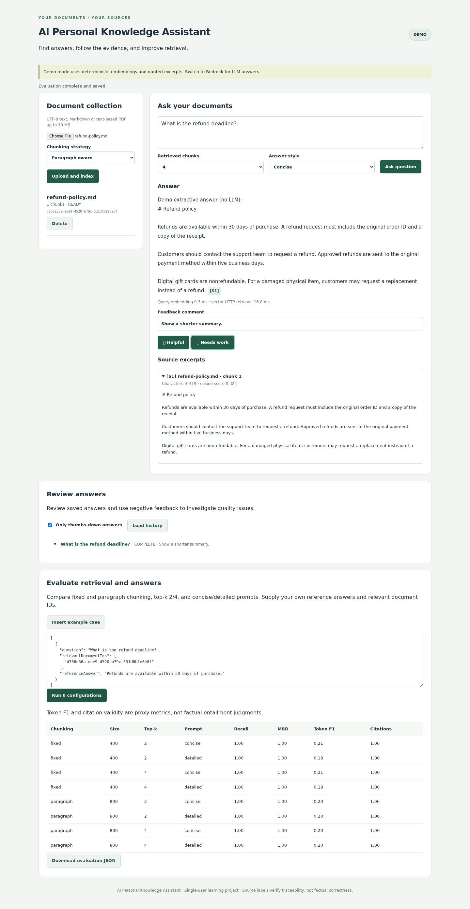

# AI Personal Knowledge Assistant

A full-stack application for answering questions about private documents with source citations. Built with **Java 21, Spring Boot, Spring AI, Amazon Bedrock, FAISS, React, and TypeScript**.

Upload text, Markdown, or text-based PDFs; retrieve relevant passages; stream a grounded answer; inspect the sources; and leave feedback. Run an evaluation matrix to compare chunking strategies, retrieval settings, and prompt variants.



## Features

- **Document ingestion:** UTF-8 `.txt`/`.md` and PDF text extraction, bounded uploads, stable source offsets, deletion, and retryable ingestion.
- **Two chunking strategies:** overlapping fixed character windows and paragraph-aware windows.
- **Bedrock integration:** Spring AI Titan text embeddings and Converse chat generation. The provider uses the AWS SDK credential chain.
- **FAISS retrieval:** normalized vectors, exact cosine similarity through `IndexFlatIP`, in-memory index reuse, atomic index/metadata snapshots, and restart recovery.
- **Streaming and citations:** named SSE events, clickable `[S1]` and grouped `[S1, S3]` source links, excerpt navigation, citation-label validation, and stream error handling.
- **Feedback:** thumbs up/down and comments linked to the saved question, answer, retrieved excerpts, model mode, and timing data. A review view filters negative feedback.
- **Evaluation:** isolated indexes, configurable chunking/top-k/prompt matrices, document recall/precision, reciprocal rank, answer token F1, citation validity, and per-case outputs.
- **Repeatable verification:** Java/Python/TypeScript tests, real HTTP integration checks, Playwright browser acceptance checks, and a reproducible retrieval benchmark.

## Quick start: no AWS account required

Install Docker with Compose v2, then run from the repository root:

```bash
cp .env.example .env
docker compose up --build
```

Open **http://localhost:5173**. The API is at **http://localhost:8080/api**.

1. Upload `examples/refund-policy.md`.
2. Ask: `What is the refund deadline?`
3. Click `[S1]` to inspect the source passage.
4. Submit feedback, then load the negative-answer history.
5. Insert an evaluation case and run the eight configurations.

The default **demo** provider uses deterministic hash embeddings and extractive answers. It is explicitly labeled in the UI and does not call an LLM. All ingestion, FAISS retrieval, SSE, persistence, evaluation, and feedback paths are real.

```bash
docker compose down       # Stop; keep documents and answer history.
```

The first build downloads dependencies. Subsequent builds reuse normal Docker layers. The vector service is private to the Compose network; published ports bind to localhost.

## Run with Amazon Bedrock

Set these values in your local `.env`:

```dotenv
APP_PROFILE=bedrock
AWS_REGION=us-east-1
BEDROCK_CHAT_MODEL=amazon.nova-lite-v1:0
AWS_ACCESS_KEY_ID=YOUR_TEMPORARY_ACCESS_KEY
AWS_SECRET_ACCESS_KEY=YOUR_TEMPORARY_SECRET_KEY
AWS_SESSION_TOKEN=YOUR_SESSION_TOKEN
```

Use credentials authorized for the configured region and models, then restart:

```bash
docker compose up --build -d
```

The chat model is configurable. Embeddings use `amazon.titan-embed-text-v2:0` through Spring AI. Bedrock access requires the appropriate `bedrock:InvokeModel` and `bedrock:InvokeModelWithResponseStream` permissions and model availability in your account/region. If using an inference profile, supply its model/profile ID and grant its required resources. A sample policy template is in `docs/bedrock-policy.example.json`.

**Bedrock mode incurs AWS charges** and sends document chunks/query text to Bedrock. Demo and Bedrock have separate data namespaces; upload documents again after switching modes. Changing an embedding model or its dimensions requires a new index/re-ingestion.

For a native backend, the default AWS SDK credential chain also supports local AWS profiles or workload roles. No credentials belong in source control. See [security and privacy scope](SECURITY.md).

To verify the Bedrock path end to end (Titan embedding, FAISS retrieval, Converse generation, and citation validation), start Bedrock mode and run:

```bash
python3 scripts/bedrock_smoke.py
```

## Native development

Prerequisites: **JDK 21**, **Maven 3.9+**, **Node 22**, **Python 3.12**. Three terminals are needed.

Terminal 1 — FAISS:

```bash
cd vector-service
python3 -m venv .venv
source .venv/bin/activate
pip install -r requirements.txt
python -m uvicorn app:app --host 127.0.0.1 --port 8000
```

Terminal 2 — Java API:

```bash
cd backend
mvn spring-boot:run
```

Terminal 3 — React:

```bash
cd web
npm ci
npm run dev
```

Open http://localhost:5173. Vite proxies `/api` to the backend. To use Bedrock natively, set `SPRING_PROFILES_ACTIVE=bedrock` and configure your AWS credentials before starting the backend. Additional variables are documented in [API and configuration](docs/API.md).

## Evaluation

The UI accepts a JSON array of cases, each containing a question, relevant document IDs, and a reference answer. It runs a preset matrix; the API accepts custom configurations.

For a reproducible sample comparison, start with an **empty collection**, activate the Python environment above, and run from the repository root:

```bash
python scripts/evaluate.py --output reports/evaluation.json
```

This imports the two bundled sample documents and evaluates three questions across eight configurations. It holds size/overlap constant while comparing the two strategies. Reports include the answers, references, source excerpts, metrics, and timings for inspection. The examples remain in your collection after the run.

Token F1 measures lexical overlap with the reference; citation validity checks source labels. Neither is a complete factual-correctness score. See [evaluation methodology](docs/EVALUATION.md).

## Retrieval benchmark

Reference run: **10,000 synthetic vectors, 1,024 dimensions, top-k 5, and 300 measured requests**. Warm localhost HTTP vector retrieval measured **p50 1.53 ms and p95 1.63 ms** on an Apple Silicon MacBook Air. It includes request/response serialization, service processing, and FAISS lookup, and excludes query-embedding generation and LLM generation.

```bash
cd vector-service
python benchmark.py --count 10000 --dimension 1024 --queries 300
```

Results depend on hardware, index size, load, and deployment. The numbers describe vector retrieval only, not end-to-end request latency with Bedrock embedding and generation. Full results, hardware, and scope are in [benchmark-results.json](docs/benchmark-results.json); rerunning the command overwrites it.

## Tests

Run from the repository root with the Python environment activated:

```bash
(cd backend && mvn -B verify)
(cd vector-service && python -m pytest -q)
(cd web && npm ci && npm test && npm run build)
python scripts/integration_test.py
(cd web && npx playwright install chromium)
python scripts/ui_test.py
```

The integration and UI scripts launch isolated services on free localhost ports, use temporary data directories, and clean up afterward. They do not call AWS. Set `JAVA_BIN` if Java 21 is not your default executable. On minimal Linux systems, use `npx playwright install --with-deps chromium` to install browser system dependencies.

GitHub Actions runs the unit, build, HTTP, and browser checks on pushes and pull requests. A separate manually triggered workflow produces benchmark artifacts; it does not impose a hardware-dependent latency gate.

## Project map

| Location | Responsibility |
| --- | --- |
| `backend/` | Java API, extraction/chunking, AI provider boundary, retrieval orchestration, answers, feedback, evaluation |
| `vector-service/` | FAISS indexing, atomic snapshots, similarity search, tests and benchmark |
| `web/` | React/TypeScript UI, stream parser, source navigation and quality review |
| `examples/` | Small public sample documents |
| `scripts/` | Evaluation runner and end-to-end acceptance checks |
| `docs/` | Design, API reference, evaluation methodology, benchmark results |
| `.github/workflows/` | CI and manually triggered benchmark |

See [DESIGN.md](docs/DESIGN.md) for architecture and data flow, [API.md](docs/API.md) for endpoints and configuration, and [EVALUATION.md](docs/EVALUATION.md) for metric definitions.

## License

[MIT](LICENSE).
