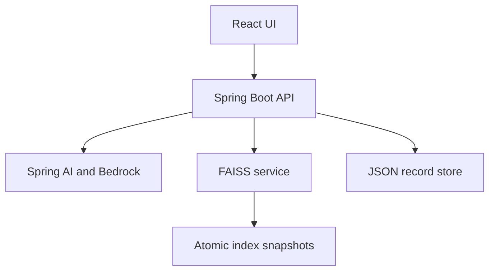

# Architecture and design

## Service boundaries

Java owns application behavior. A small Python service exposes FAISS because its native Python API provides direct access to persistent exact indexes. React consumes only the Java API. Demo mode substitutes the AI provider; it does not bypass retrieval or persistence.

## Ingestion

`KnowledgeController → DocumentService → Chunker → AiGateway.embed → VectorClient → IndexStore`.

1. Validate extension and size, extract text, and reject empty documents. PDFBox is closed with try-with-resources. Scanned PDFs need external OCR.
2. Split extracted text with the requested strategy. Chunk IDs are `document-id:ordinal`; `start` and `end` preserve Java string offsets in the extracted text. They are UTF-16 code-unit offsets, not PDF page coordinates or UTF-8 byte offsets.
3. Save an `INDEXING` record before requesting embeddings.
4. Replace that document's FAISS chunks as one index update, then mark the document `READY`.
5. If indexing fails, the durable record remains `INDEXING`; the retry endpoint repeats the document replacement idempotently. The UI exposes retry for these records.

There is no cross-service transaction. A process failure between vector publication and the `READY` write can leave vectors visible while the document remains `INDEXING`. Retrying converges both stores. This explicit recovery behavior is suitable for a single-user learning application.

Deleting a document marks it `DELETING`, removes its vectors, then removes its record. A failed deletion can be retried through the same delete operation. Historical answers/evaluations retain source snapshots for auditability.

## Chunking algorithms

- **Fixed:** overlapping bounded character windows. Preserves the document tail and original offsets.
- **Paragraph:** starts with the same maximum window but prefers a blank-line boundary in its latter region. A long paragraph falls back to a bounded character window. Overlap still applies.

Bounds are enforced both at input validation and within splitting: size 100–4,000 characters, overlap below size, at most 2,000 chunks per document, extracted text at most 500,000 characters, upload at most 10 MB. These are character-based strategies, not tokenizer-based or semantic chunking.

## Vector storage and queries

The service maintains one immutable `IndexFlatIP` snapshot per loaded collection. Documents and queries are L2 normalized, making inner product equivalent to cosine similarity for nonzero vectors.

An update reconstructs existing vectors, replaces one document's rows, builds a new index once, and serializes both metadata and FAISS bytes into one archive. A temporary file is flushed and fsynced, then atomically renamed. The new index becomes the in-memory cache only after publication succeeds. Readers and writers use a process lock, preventing metadata/index mismatch. Restart reads the same snapshot lazily.

**Queries reuse the loaded index.** They do not read all metadata or rebuild the index on every request. They normalize the query, search FAISS, apply a minimum score, and return source metadata. Exact search is O(Nd); writes are O(Nd) because this implementation rebuilds on update. It favors a modest personal corpus with frequent reads. The index cap is 50,000 chunks, vectors at most 4,096 dimensions. Use one worker process per data directory; this is not a distributed index.

## Answer generation and SSE

`RetrievalService` times embedding separately from the vector HTTP request. `AnswerService` assigns short source labels and calls the selected AI provider. BedrockGateway places grounding instructions in a system message and document excerpts in the user context. The model is instructed to abstain when sources are insufficient.

Spring MVC's `SseEmitter` produces actual named SSE frames. The worker sends `sources`, then JSON `token` events, persists the completed answer, and sends `done`. Errors emit `error`; partial answers are stored as `INCOMPLETE` when retrieval has completed. Closing the provider stream cancels its subscription after a client send failure. The worker pool and request timeout are bounded.

The UI incrementally decodes UTF-8, handles arbitrary transport chunk boundaries and CRLF, and rejects a stream that ends without `done`. Valid source labels become buttons that expand the matching excerpt. Citation checks identify unknown labels or missing citations. They do not establish that every claim is entailed by a source.

## Feedback and quality review

Answers are atomically saved with the question, final text, source snapshots, timing breakdown, provider mode, prompt variant, citation-check result and creation time. Feedback updates that same answer record with a rating, comment and timestamp. The negative-only list makes low-quality responses inspectable after restart or document deletion. The last submitted feedback for an answer wins.

## Evaluation isolation

For each chunking configuration, `EvaluationService` creates a temporary collection and indexes the corpus once. Retrieval results for each top-k value are reused across prompt variants. It generates answers, computes deterministic reference-based metrics, saves all case-level outputs, and deletes temporary indexes in `finally`.

Normal failures clean up temporary collections. A hard process kill can leave `eval-*` snapshots; they never enter the main collection and may be removed when services are stopped. Evaluations are synchronous, intended as offline experiments, and can be expensive in Bedrock mode.

## Deliberate scope

This repository implements a single-user local application with durable local storage. It does not provide multi-tenant authentication, distributed transactions, OCR, semantic citation entailment, automatic retraining from feedback, or an autonomous tool-calling agent. See `SECURITY.md` for the data/privacy boundary.

## Primary references

- [Spring AI Bedrock](https://docs.spring.io/spring-ai/reference/api/bedrock.html)
- [Spring AI Bedrock Converse](https://docs.spring.io/spring-ai/reference/api/chat/bedrock-converse.html)
- [Spring AI Titan embeddings](https://docs.spring.io/spring-ai/reference/api/embeddings/bedrock-titan-embedding.html)
- [FAISS metrics and normalization](https://github.com/facebookresearch/faiss/wiki/MetricType-and-distances)
- [FAISS index I/O](https://github.com/facebookresearch/faiss/wiki/Index-IO%2C-cloning-and-hyper-parameter-tuning)

The code is pinned to Spring AI 1.1.4. Its embedded configuration metadata specifies `spring.ai.bedrock.converse.chat.options.model`; do not copy a property name from a different release without checking it.
